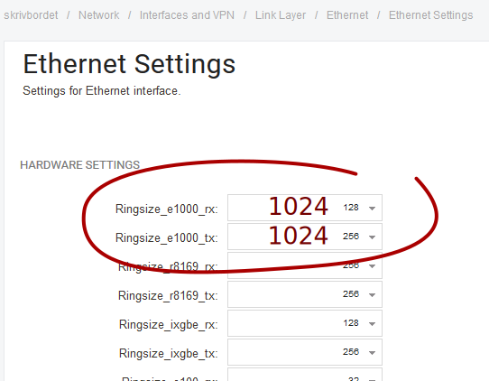
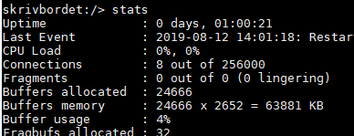

# Suitable ring sizes for gigabit Ethernet interfaces

Adjust the right setting for your interface type, e.g. the "Ringsize_e1000_..." settings for e1000 interfaces.

An RX ring size of 1000 packets means that the system will tolerate up to 1 ms of delay between servicing the queues in a 1 MPPS scenario before losing packets.

# Increase number of system packet buffers if necessary
In a 6-interface system, 1024 buffers on RX queues, and up to 1024 on TX queues when full, will consume (1024+1024)  x 6 = 12288 packet buffers total.

The currently-allocated number is shown in the "stats" console command:

On this example E80, 24666 buffers are allocated by default, so 12288 is only about half of that, and the setting probably does not need to be increased - there's still 50% buffers available for other queues. Though if there is enough RAM available, it would certainly be advisable to increase the **HighBuffers** setting (first make it NOT dynamic!) to get the peak usage down to 25%, in order to leave room for packet queueing in other subsystems!

Use the **mem** console command to see how much free RAM there is. If there is not enough, the first thing to tune down is typically the maximum number of statefully-tracked connections - the **MaxConnections** setting.

After changing HighBuffers or MaxConnections, a core restart is needed (e.g "shutdown 1" on the console).

# Related articles








