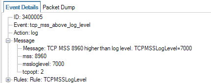

Log events like the above are becoming a common occurence as more and more servers become connected to jumbogram networks - even though the Internet at large does not support larger frames than standard Ethernet.

# Changing the TCPMSSLogLevel
To suppress the log events, simply set the "TCPMSSLogLevel" setting to e.g. 9000. Or 8960 if you like.

The default value for this setting will be changed in a future release of cOS Core.

# Related articles









