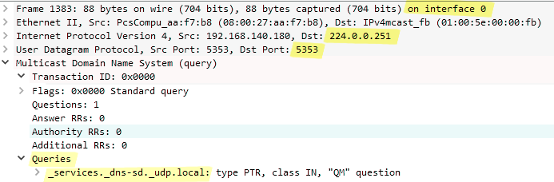
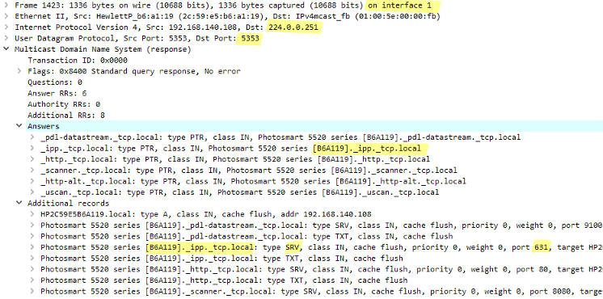
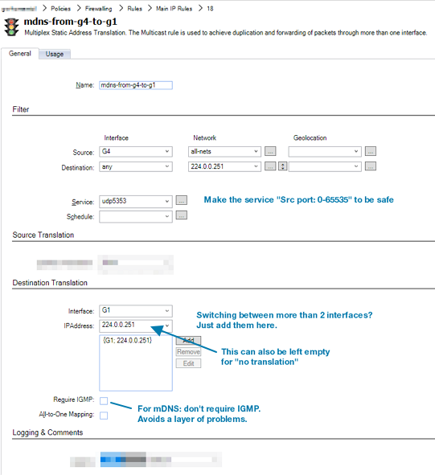
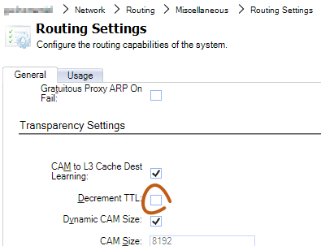
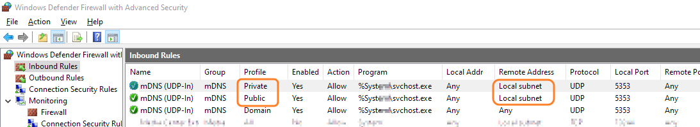
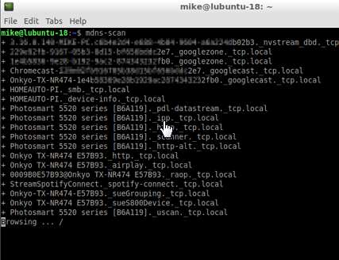

# mDNS? Bonjour? AirSomething?

<ac:rich-text-body> More specifically, <a href="http://www.dns-sd.org/">DNS-SD</a> _typically_ runs on top of mDNS, but technically speaking it can query a regular DNS server, too, if the server is configured to hand out these records. But that's unusual.

</ac:rich-text-body>
First, it's important to understand that these are all (mostly) about UDP multicasts to address 224.0.0.251, port 5353. Aka "multicast DNS", mDNS.

Example mDNS query from a Linux host running "mdns-scan":

Example mDNS response from a multifunction printer/scanner:

# Strategy - IGMP or not?

<ac:rich-text-body> IGMP makes more sense for large data streams, where you want to limit the amount of traffic flowing. Here, you always want to receive the mDNS packets.

</ac:rich-text-body>
We can opt to work with IGMP Rules (under the Routing subsection), which also works, but _assumes_ that all units speak IGMP correctly.

It would also mean delays in our testing - _nothing would work until the firewall receives the IGMP rebroadcasts_.

So, we opt to simply go for raw **SAT Multiplex** rules: **Always forward the multicasts,** regardless of hearing IGMP or not.

# How to configure
## Enable transparent mode
First, **Transparent Mode** most likely needs to be enabled on the involved interfaces.

-- Without it, TTL=1 multicasts will be dropped. (But if all systems use higher TTLs it will likely still work? Untested.)

Note that "Forward Broadcast Traffic" does _not_ need to be enabled on the interfaces for this to work. mDNS uses multicast, not broadcast.

## But I don't want switched routes, L3C, CAM, and all of that?
That's fine. Simply configure static routes. It's just that Transparent Mode on the sending interface is currently a requirement for leaving the IP TTL untouched in cOS Core.

With static routes + Transparent Mode, the only 2 differences will be:

<ul><li>MAC addresses are not hidden</li><li>We can leave the IP TTL alone</li></ul>## Add Multiplex SAT rules for mDNS in both directions

<ac:rich-text-body> _Can you use interface groups to make it a single rule?_

Yes, it'll work, but unfortunately the firewall <u>will also duplicate the packet back</u> out the interface it came from, which is <u>possibly dangerous</u> if there is another unit doing the same.

</ac:rich-text-body>
As you see in the packet traces, mDNS responses do not arrive to the IP address that sent the query. They are sent out to the multicast address.

Therefore, mDNS multicasts have to be separately **allowed in both directions**.

... and of course **one more in the opposite direction**.

<ac:task-list>
<ac:task>
<ac:task-id>1</ac:task-id>
<ac:task-status>incomplete</ac:task-status>
<ac:task-body>Make RFE about interface groups in sat multiplex - don't send back out where it came from!</ac:task-body>
</ac:task>
</ac:task-list>
<ac:rich-text-body> Technically, the firewall defaults to adding a route for 224.0.0.0/4 to "core" so you _could_ also set the destination interface to "core". 

</ac:rich-text-body>
Note the "Destination: any" in the filter - it does not make sense to filter according to the routing table here.

## Add rule for Internet Printing Protocol
This is entirely straightforward.

Allow traffic to the printer's IP address, TCP port 631.

## Double check TTL setting
In case a unit sends mDNS packets with IP TTL=1, we may want to make sure we don't decrement it to 0 and drop it.

There may also be mDNS clients that check for TTL still being 255 on receipt, i.e. that the packet didn't traverse a network boundary.

Either way, it's a good idea to make sure that TTL is left untouched:

### That's a lot of talk about TTL?
Well, <a href="https://tools.ietf.org/html/rfc6762">https://tools.ietf.org/html/rfc6762</a> says this:

<pre>11. Source Address Check</pre><pre>   All Multicast DNS responses (including responses sent via unicast)
   SHOULD be sent with IP TTL set to 255.  This is recommended to
   provide backwards-compatibility with older Multicast DNS queriers
   (implementing a draft version of this document, posted in February
   2004) that check the IP TTL on reception to determine whether the
   packet originated on the local link.  These older queriers discard
   all packets with TTLs other than 255.
</pre>And additionally, there are recommendations for dropping mDNS packets if the source IP address does not belong on the local network.

 If you find an mDNS that implementation refuses to cross the firewall boundary, you may have to renumber your IP ranges to match.

Microsoft's mDNS implementation for instance, _may_ give you problems via Windows Defender Firewall. But here you can simply re-configure the rules.

## Test it!

# Related articles









