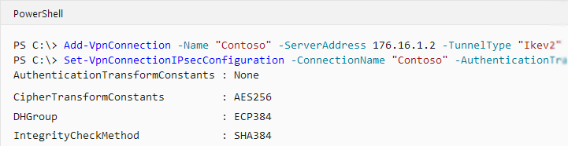
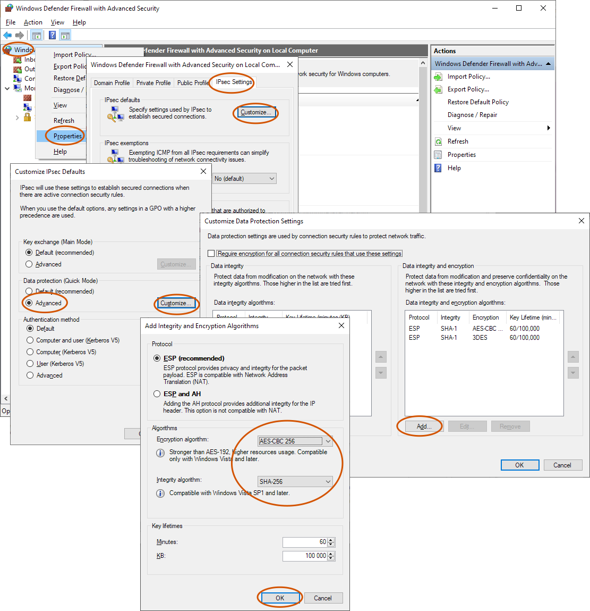

# Windows 10 IKEv2 Phase 2 (IPsec) proposals
Windows 10 (2019) has a very limited proposal list for Phase 2:

<table class="wrapped"><colgroup><col/><col/><col/></colgroup><tbody><tr><th>Encrypt</th><th>HMAC</th><th colspan="1">DH (PFS)</th></tr><tr><td>AES256</td><td>SHA1-96</td><td colspan="1">None</td></tr><tr><td>3DES</td><td>SHA1-96</td><td colspan="1">None</td></tr></tbody></table># Change defaults in the registry
It is possibly to registry-patch Windows to use stronger crypto See e.g. <a href="https://duckduckgo.com/?q=NegotiateDH2048_AES256">the "NegotiateDH2048_AES256" registry value</a>

# Change the settings of a single tunnel via PowerShell "Set-VpnConnectionIPsecConfiguration"
<a href="https://docs.microsoft.com/en-us/powershell/module/vpnclient/set-vpnconnectionipsecconfiguration?view=win10-ps">https://docs.microsoft.com/en-us/powershell/module/vpnclient/set-vpnconnectionipsecconfiguration?view=win10-ps</a>

# GUI lets you improve the default ciphers and HMACs, but not DH Groups

# Footnotes
<ul><li>Diffie-Hellman group 2 (1024 bit) is no longer considered secure against state-level actors or equivalent. See <ac:link><ri:page ri:content-title="LogJam"/><ac:plain-text-link-body>LogJam</ac:plain-text-link-body></ac:link>.</li><li>SHA1 is known to be flawed, but is still fine for use as an HMAC, as the flaws are mitigated by the HMAC construct. Additionally, there is simply no time to mount an attack from one packet to the next</li></ul>

# Related articles








