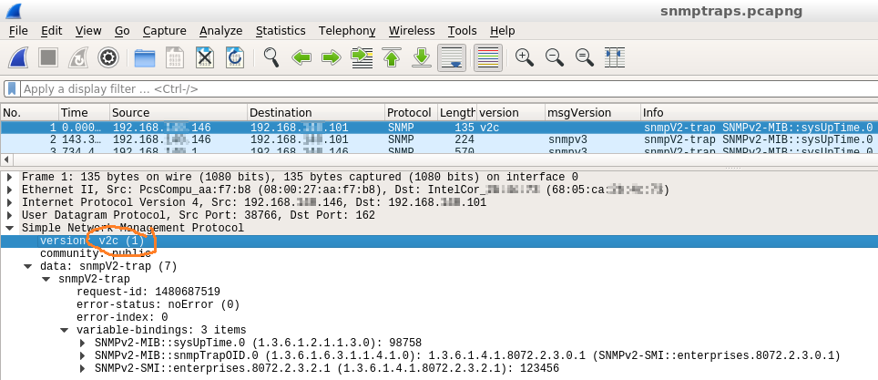
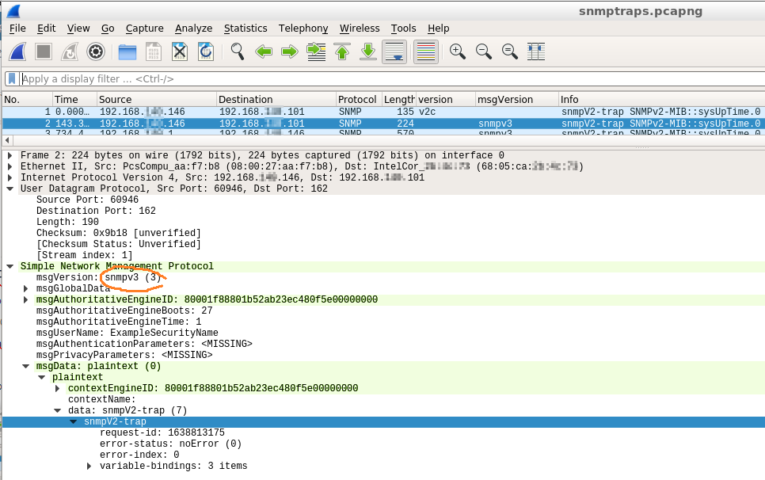

# Manually testing SNMP trap behavior using ucs-snmp
This can be tested on e.g. a Linux host:

<ac:structured-macro><ac:parameter>bash</ac:parameter><ac:plain-text-body>$ snmptrap -v 2c -c public 192.168.0.101 '' 1.3.6.1.4.1.8072.2.3.0.1 1.3.6.1.4.1.8072.2.3.2.1 i 123456

$ snmptrap -v 3 -u ExampleSecurityName -l noAuthNoPriv 192.168.0.101 '' 1.3.6.1.4.1.8072.2.3.0.1 1.3.6.1.4.1.8072.2.3.2.1 i 123456</ac:plain-text-body></ac:structured-macro>If you walk inside the packet data, you'll see that the trap data itself is identical in both v2 and v3, but they're wrapped in different headers (v2 vs v3).

## SNMPv2 trap:

## SNMPv3 trap

Note that the contained data is still identified as a "v2 trap", it is unchanged.

# Related articles









