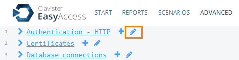
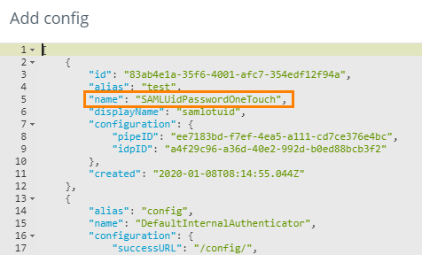
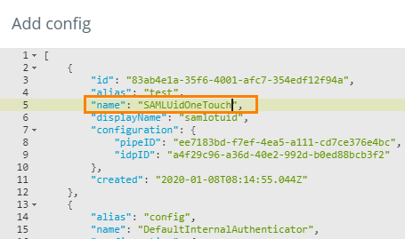
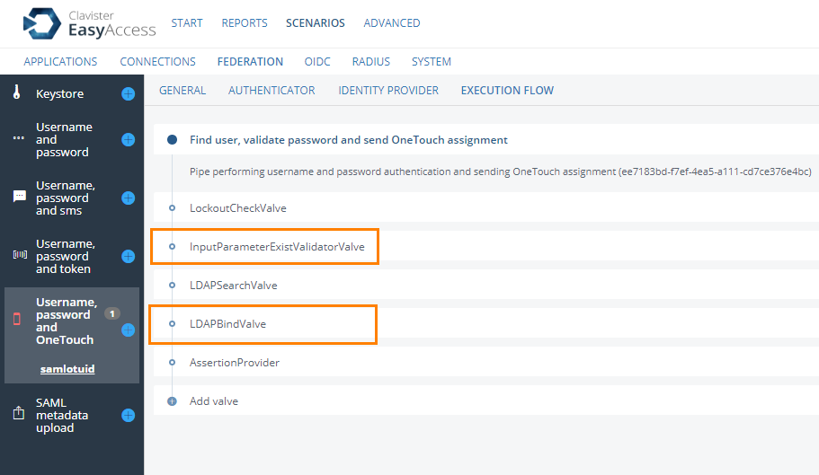
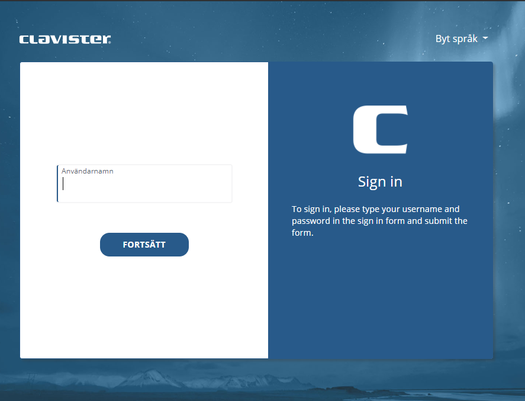
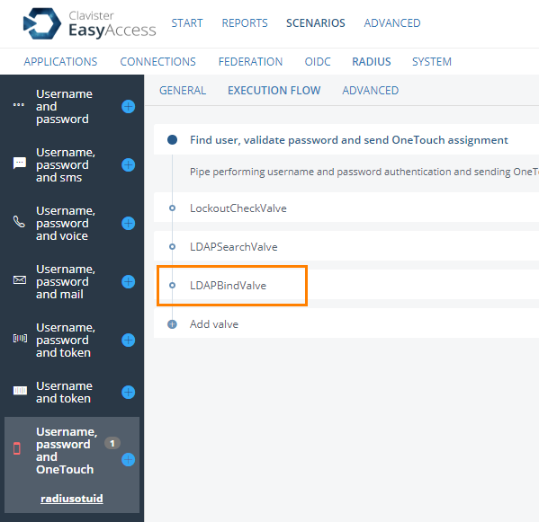

# SAML Authentication
For SAML authentication we need to change the authenticator used to be SAMLUidOneTouch. Login to the WebUI and go to the advance tab, click on the pen besides Authentication - HTTP:

Find your SAML authenticator:

Change the name value to SAMLUidOneTouch, stage changes and commit.

Next we need to remove some Valves from the execution flow since we still expect a password but there is no way for the user to enter a password. Go to Scenarios → Federation and click on your Username, Password and OneTouch scenario. Go to the Execution Flow tab. Delete the InputParameterExistValve and the LDAPBindValve. Click save.

We are now done the user will now see the following page when surfing to the authenticator URL:

# Radius Authentication
With RADIUS authentication it will be different we can't control client it self that connects, for example the OneConnect client (at the moment) will always show the password field even though we do this change on the EasyAccess server. The only thing we need to do here is to remove the LDAPBindValve from the Execution flow on the normal Username, Password and OneTouch RADIUS scenario.

Go to Scenarios → RADIUS and click on the Username, Password and OneTouch scenario. Go to the Execution Flow tab and delete the LDAPBindValve:

Click save. The users will now be able to login without password.

# Related articles









