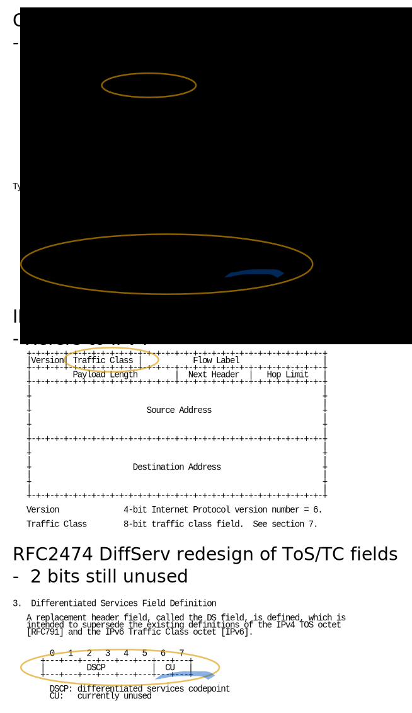
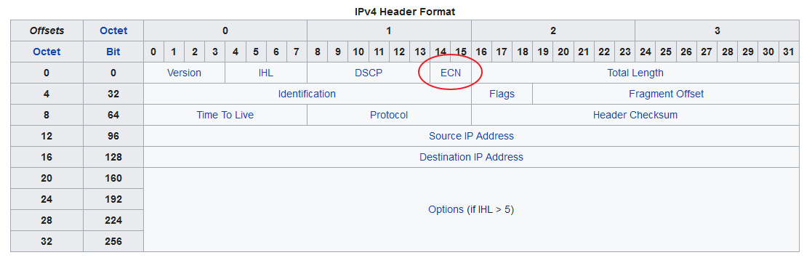
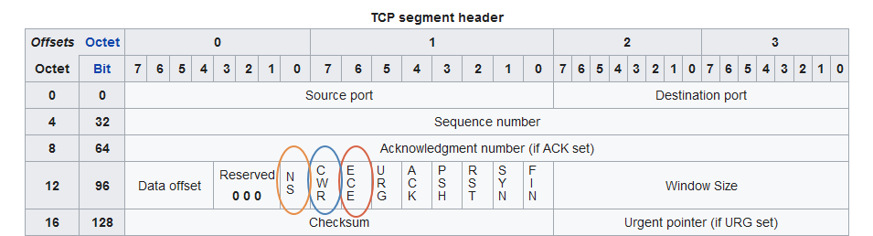

# Signalling Congestion - forward direction - IP header

<ul><li><code>00</code> – Non ECN-Capable Transport, Non-ECT</li><li><code>10</code> – ECN Capable Transport, ECT(0)</li><li><code>01</code> – ECN Capable Transport, ECT(1)</li><li><code>11</code> – Congestion Encountered, CE.</li></ul>So, if the sender sets the bits to "00", no router will mark the packet as congested, as they then assume ECN is not supported.

# Notifying the sender - return direction - TCP header
When a host receives "Congestion Encountered, CE" in the IP header of a packet, it has to somehow notify the sender of this for it to be useful.

For a TCP connection, this happens in the TCP ACK packet returned.

<ul><li>ECE - Echo of Congestion Encountered - starts being set in TCP packets when "CE" is seen</li><li>CWR - Congestion Window Reduced = "OK, I saw your ECE, you can turn it off now"</li><li>NS = Nonce Sum <a href="https://tools.ietf.org/html/rfc3540">RFC3540</a> was meant to improve robustness of the protocol but was never standardized. The bit assignment still remains in the specification, however, and should be treated the same way as ECE and CWD - either passed-on, or stripped.</li></ul>
# Problems with firewalls
ECE and CWR were not defined in the original TCP specification, and were often referred to as "christmas-tree lamp test" bits- XMAS and, naturally, YMAS.

Firewalls long took them as an indication of "something fishy" going on and defaulted to blocking packets that had them set, leading to ECN-enabled TCP connections breaking.

See <a href="https://tools.ietf.org/html/bcp60">BCP60 - Inappropriate TCP Resets Considered Harmful</a> by ECN wizard Sally Floyd for a write-up on this subject. (And yes the Mikael Olsson in the Acknowledgements sections is ours)

## ECN in cOS Core
Clavister cOS Core has long defaulted to _stripping_ the ECN bits which does not break TCP, but does disable ECN. This due to the fact that there have been bugs in endpoints (and, notably, other firewalls, e.g. <a href="https://cve.mitre.org/cgi-bin/cvename.cgi?name=CVE-2001-0183">CVE-2001-0183 - FreeBSD ipfw allowing ruleset bypass with ECE bit set</a>) related to this bit, and the simple fact that ECN functionality was only recently widely-enabled by default.

cOS Core's behavior is controlled by the "TCPECN" setting.

As of mid 2020, v12.00.24 and v13.00.06, the TCPECN setting defaults to **"Ignore**", meaning that it passes the ECN-related bits through, **unmodified**.

# Further reading
<ul><li><a href="https://en.wikipedia.org/wiki/Explicit_Congestion_Notification">https://en.wikipedia.org/wiki/Explicit_Congestion_Notification</a></li><li><a href="https://tools.ietf.org/html/rfc8087">RFC8087 - The Benefits of Using Explicit Congestion Notification (ECN)</a></li></ul>
# Related articles









