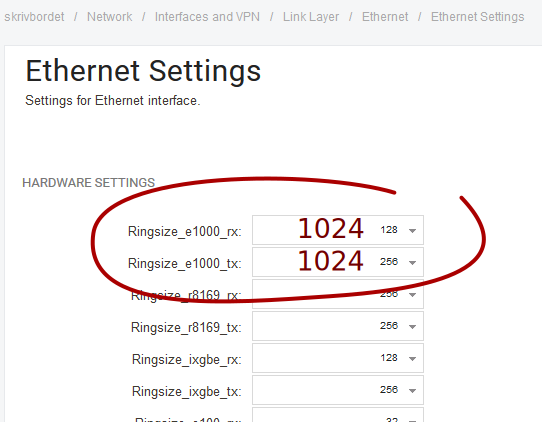
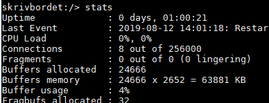

<table class="wysiwyg-macro" data-macro-name="excerpt" data-macro-id="2a6e168f-b284-4015-a70f-5110bdc4ede8" data-macro-parameters="atlassian-macro-output-type=INLINE" data-macro-schema-version="1" style="background-image: url(/plugins/servlet/confluence/placeholder/macro-heading?definition=e2V4Y2VycHQ6YXRsYXNzaWFuLW1hY3JvLW91dHB1dC10eXBlPUlOTElORX0&amp;locale=en_GB&amp;version=2); background-repeat: no-repeat;" data-macro-body-type="RICH_TEXT"><tr><td class="wysiwyg-macro-body">
In high-load scenarios, you may need to increase to the size of RX and TX rings beyond the default settings (e.g. Ringsize_e1000_rx), and possibly also increase the total number of packet buffers in the system (Highbuffers).
</td></tr></table>

 

<table class="wysiwyg-macro" data-macro-name="details" data-macro-id="d6c80c04-42e9-45c0-8446-1df87ed8ca22" data-macro-schema-version="1" style="background-image: url(/plugins/servlet/confluence/placeholder/macro-heading?definition=e2RldGFpbHN9&amp;locale=en_GB&amp;version=2); background-repeat: no-repeat;" data-macro-body-type="RICH_TEXT"><tr><td class="wysiwyg-macro-body"><table class="wrapped confluenceTable">
<colgroup> <col> <col> </colgroup>
<tbody>
<tr>
<td class="confluenceTd">
Up to date for
</td>
<td class="confluenceTd">
Core 12.00.19
</td>
</tr>
<tr>
<td colspan="1" class="confluenceTd">Status</td>
<td colspan="1" class="confluenceTd">

 

</td>
</tr>
</tbody>
</table></td></tr></table>

<h1>Suitable ring sizes for gigabit Ethernet interfaces</h1>

Adjust the right setting for your interface type, e.g. the "Ringsize_e1000_..." settings for e1000 interfaces.

An RX ring size of 1000 packets means that the system will tolerate up to 1 ms of delay between servicing the queues in a 1 MPPS scenario before losing packets.

<h1>Increase number of system packet buffers if necessary</h1>

In a 6-interface system, 1024 buffers on RX queues, and up to 1024 on TX queues when full, will consume (1024+1024)  x 6 = 12288 packet buffers total.

The currently-allocated number is shown in the "stats" console command:

On this example E80, 24666 buffers are allocated by default, so 12288 is only about half of that, and the setting probably does not need to be increased - there's still 50% buffers available for other queues. Though if there is enough RAM available, it would certainly be advisable to increase the <strong>HighBuffers</strong> setting (first make it NOT dynamic!) to get the peak usage down to 25%, in order to leave room for packet queueing in other subsystems!

Use the <strong>mem</strong> console command to see how much free RAM there is. If there is not enough, the first thing to tune down is typically the maximum number of statefully-tracked connections - the <strong>MaxConnections</strong> setting.

After changing HighBuffers or MaxConnections, a core restart is needed (e.g "shutdown 1" on the console).

<h1>Related articles</h1>

 

 

 

