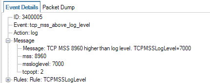

<table class="wysiwyg-macro" data-macro-name="excerpt" data-macro-id="2a6e168f-b284-4015-a70f-5110bdc4ede8" data-macro-parameters="atlassian-macro-output-type=INLINE" data-macro-schema-version="1" style="background-image: url(/plugins/servlet/confluence/placeholder/macro-heading?definition=e2V4Y2VycHQ6YXRsYXNzaWFuLW1hY3JvLW91dHB1dC10eXBlPUlOTElORX0&amp;locale=en_GB&amp;version=2); background-repeat: no-repeat;" data-macro-body-type="RICH_TEXT"><tr><td class="wysiwyg-macro-body">
For a long time, TCP MSS (Maximum Segment Size) above 1460 was abnormal. However, with the advent of jumboframe-capable hosts, we now see TCP MSS announcements of 8960. The setting can safely be raised to 9000.
</td></tr></table>

 

 

<table class="wysiwyg-macro" data-macro-name="details" data-macro-id="d6c80c04-42e9-45c0-8446-1df87ed8ca22" data-macro-schema-version="1" style="background-image: url(/plugins/servlet/confluence/placeholder/macro-heading?definition=e2RldGFpbHN9&amp;locale=en_GB&amp;version=2); background-repeat: no-repeat;" data-macro-body-type="RICH_TEXT"><tr><td class="wysiwyg-macro-body"><table class="wrapped confluenceTable">
<colgroup> <col> <col> </colgroup>
<tbody>
<tr>
<td class="confluenceTd">
Up to date for
</td>
<td class="confluenceTd">

Core 12.00.20

 

</td>
</tr>
<tr>
<td colspan="1" class="confluenceTd">Status</td>
<td colspan="1" class="confluenceTd">

  

</td>
</tr>
</tbody>
</table></td></tr></table>

Log events like the above are becoming a common occurence as more and more servers become connected to jumbogram networks - even though the Internet at large does not support larger frames than standard Ethernet.

<h1>Changing the TCPMSSLogLevel</h1>

To suppress the log events, simply set the "TCPMSSLogLevel" setting to e.g. 9000. Or 8960 if you like.

The default value for this setting will be changed in a future release of cOS Core.

 

<h1>Related articles</h1>

 

 

